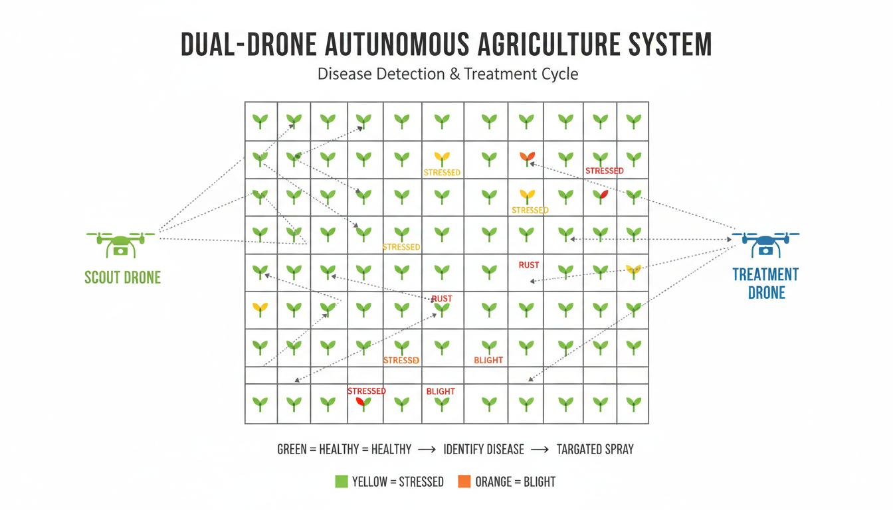
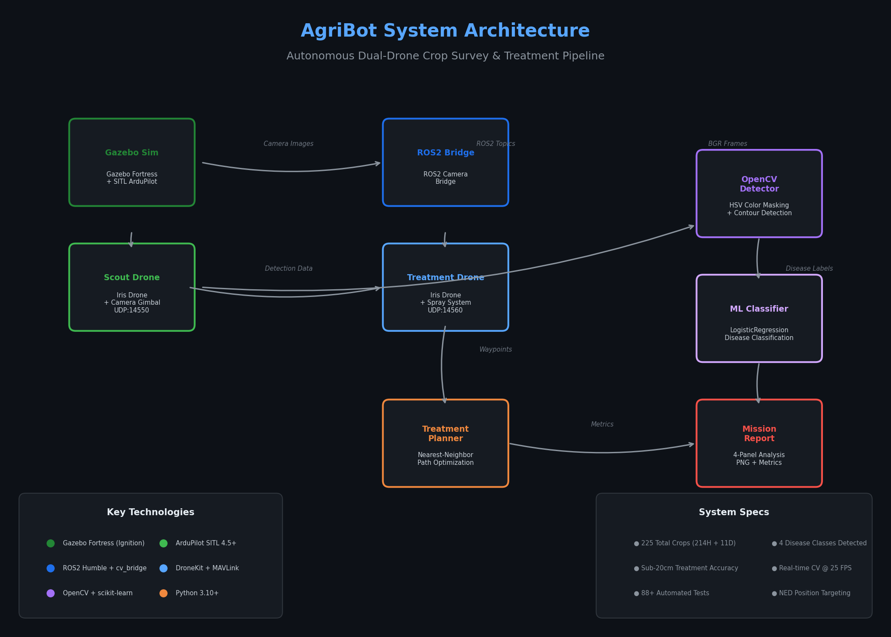
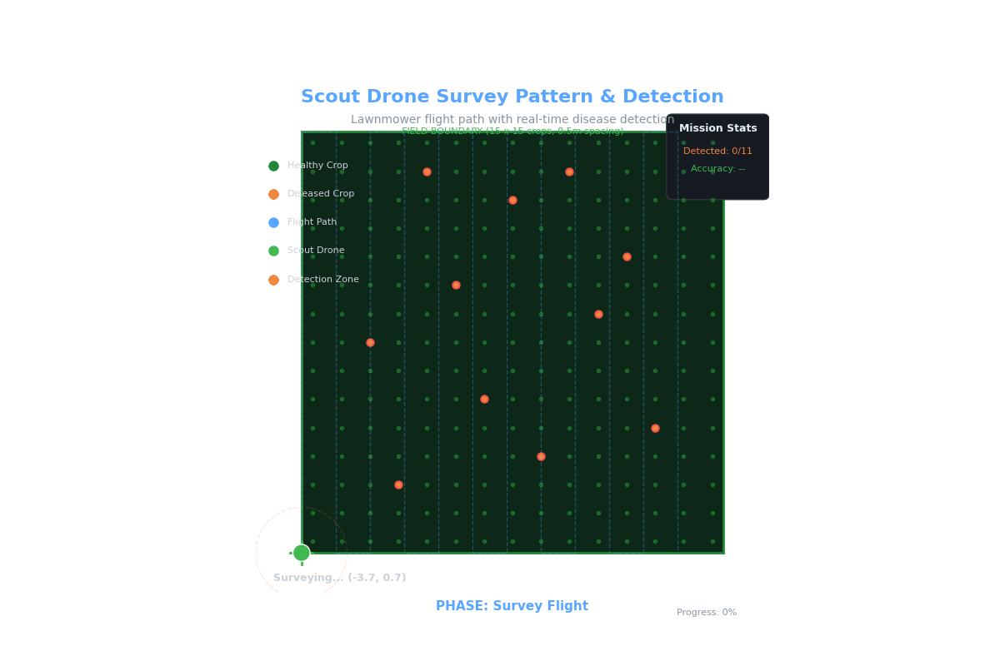
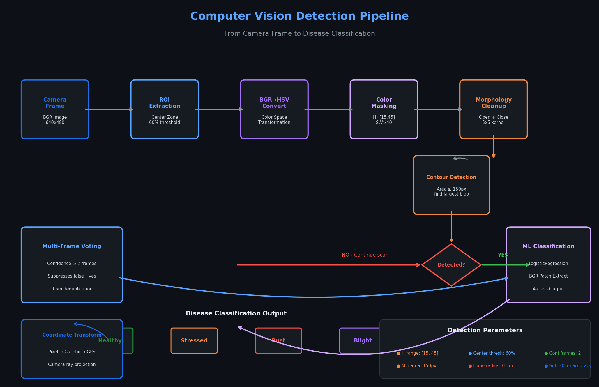
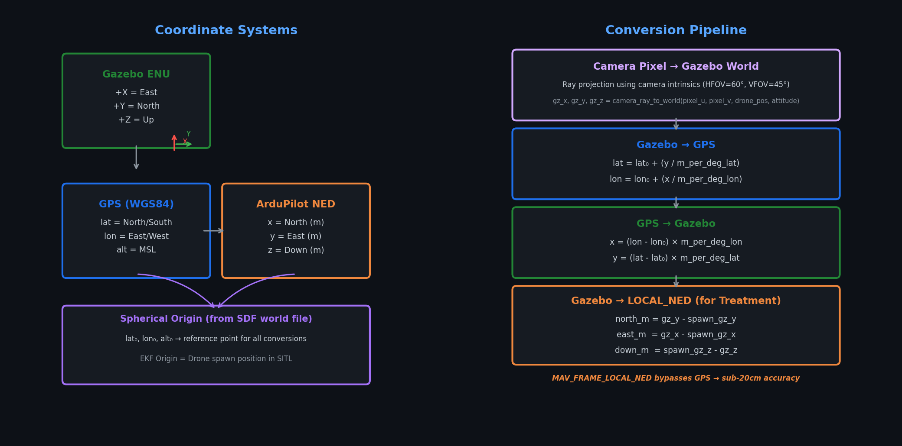

<div align="center">


<h1>AgriBot &mdash; Autonomous Dual-Drone Crop Survey & Treatment</h1>

<p><strong>Two drones, one mission:</strong> scout the field with a camera, detect diseased crops using real-time computer vision and machine learning, and fly the treatment drone precisely to each infected plant for simulated spraying.</p>

<p>
  
  
  
  
  
  
  
  
</p>

<p>
  <a href="#-quick-start">Quick Start</a> &bull;
  <a href="#-system-architecture">Architecture</a> &bull;
  <a href="#-how-it-works">How It Works</a> &bull;
  <a href="#-detection-pipeline">Detection Pipeline</a> &bull;
  <a href="#-coordinate-systems">Coordinates</a> &bull;
  <a href="#-api-reference">API</a>
</p>

</div>

---

## Table of Contents

- [Overview](#overview)
- [Key Features](#key-features)
- [System Architecture](#system-architecture)
- [Quick Start](#quick-start)
- [How It Works](#how-it-works)
  - [Phase 1: Scout Survey](#phase-1-scout-survey)
  - [Phase 2: Real-Time Detection](#phase-2-real-time-detection)
  - [Phase 3: Disease Classification](#phase-3-disease-classification)
  - [Phase 4: Treatment Targeting](#phase-4-treatment-targeting)
  - [Phase 5: Post-Mission Report](#phase-5-post-mission-report)
- [Detection Pipeline](#detection-pipeline)
- [Coordinate Systems](#coordinate-systems)
- [Project Structure](#project-structure)
- [Module Reference](#module-reference)
- [Installation](#installation)
- [Testing](#testing)
- [Configuration](#configuration)
- [Troubleshooting](#troubleshooting)
- [Technical Deep Dive](#technical-deep-dive)
- [License](#license)

---

## Overview

**AgriBot** is a fully autonomous dual-drone agriculture simulation system built on ROS2, Gazebo Fortress, and ArduPilot SITL. It demonstrates end-to-end precision agriculture: one drone (the **scout**) surveys a crop field using a systematic lawnmower pattern while streaming live camera footage through a ROS2 bridge; real-time computer vision detects and classifies diseased plants; a second drone (the **treatment**) then visits each infected crop with sub-20cm positional accuracy for simulated treatment.

The simulation environment contains **225 crops** arranged in a 15&times;15 grid (0.5m spacing), including **214 healthy** and **11 diseased** plants across 4 disease categories: **Stressed**, **Rust**, **Blight**, and **Healthy**.

<div align="center">

<br>
<em>Field layout: Scout drone (green) performs lawnmower survey while Treatment drone (blue) targets infected crops</em>
</div>

---

## Key Features

| Feature | Description |
|---------|-------------|
| **Dual-Drone Coordination** | Scout and treatment drones operate autonomously with shared mission state via JSON detection files |
| **Real-Time CV Detection** | OpenCV HSV color masking at 25 FPS with morphological cleanup and multi-frame voting |
| **ML Disease Classification** | scikit-learn LogisticRegression classifier trained on empirical RGB samples from Gazebo |

| **Camera Calibration** | Automatic axis-mapping calibration by hovering above a known infected crop |
| **Duplicate Prevention** | 0.5m radius deduplication with multi-frame confidence voting (2 frames) |
| **Nearest-Neighbor Path Planning** | Greedy TSP heuristic optimizes treatment drone visit order |
| **Infection Clustering** | KMeans/DBSCAN clustering identifies disease hotspots |
| **Post-Mission ML Report** | Auto-generated 4-panel report: detection log, confusion matrix, bar chart, cluster map |
| **Comprehensive Testing** | 88+ automated tests covering all critical modules |

---

## System Architecture

<div align="center">

<br>
<em>Full system architecture showing data flow between simulation, drones, computer vision, and ML pipeline</em>
</div>

### Architecture Overview

```
Gazebo Fortress (Simulation Environment)
    │
    ├── SITL ArduPilot Instance #1 ←── Scout Drone (UDP:14550)
    │       │
    │       └── Camera Gimbal → ROS2 Topic: /scout_camera
    │
    ├── SITL ArduPilot Instance #2 ←── Treatment Drone (UDP:14560)
    │       │
    │       └── Spray System → ROS2 Topic: /treatment_camera
    │
    └── ROS2 Camera Bridge
            │
            └── BGR Frames → OpenCV Processing
                    │
                    ├── HSV Color Masking (H=[15,45], S,V≥40)
                    ├── Contour Detection (area ≥ 150px)
                    ├── Multi-Frame Voting (confidence ≥ 2)
                    └── ML Classification (LogisticRegression)
                            │
                            ├── Disease Labels + Coordinates
                            └── JSON Detection File
                                    │
                                    └── Treatment Drone
                                            │
                                            ├── Nearest-Neighbor Path Planning
                                            └── Per-Crop Hover & Spray
                                                    │
                                                    └── Post-Mission Report
```

### Technology Stack

| Layer | Technology | Purpose |
|-------|-----------|---------|
| **Simulation** | Gazebo Fortress (Ignition) | Physics simulation, 3D crop environment |
| **Autopilot** | ArduPilot SITL 4.5+ | Flight controller software-in-the-loop |
| **Middleware** | ROS2 Humble | Inter-process communication, camera bridge |
| **Drone API** | DroneKit + MAVLink | Vehicle connection, command & control |
| **Vision** | OpenCV 4.x | Real-time image processing, HSV detection |
| **ML** | scikit-learn 1.x | LogisticRegression disease classifier |
| **Language** | Python 3.10+ | Primary development language |
| **OS** | Ubuntu 22.04 | Target platform |

---

## Quick Start

### Prerequisites

- Ubuntu 22.04 LTS
- ROS2 Humble Hawksbill
- Gazebo Fortress (Ignition)
- ArduPilot SITL (Copter 4.5+)
- Python 3.10+
- NVIDIA GPU (recommended for smooth rendering)

### One-Shot Launch

```bash
# Clone and enter workspace
cd /home/aditya/agribot_ws

# Launch everything (headless mode)
./launch.sh

# Or launch with Gazebo GUI
./launch.sh --gui
```

The `launch.sh` script automatically:
1. Kills any leftover processes from previous runs
2. Starts Gazebo with the farm world (`world/agribot_farm_world.sdf`)
3. Launches 2 SITL ArduPilot instances
4. Starts ROS2 camera bridges for both drones
5. Waits for simulation to stabilize (8 seconds)
6. Runs the autonomous mission script (`fly_drone.py`)

### Manual Launch (for development)

```bash
# Terminal 1: Start Gazebo
gz sim -v4 -r world/agribot_farm_world.sdf

# Terminal 2: Start SITL for Scout
cd ~/ardupilot/Tools/autotest
./sim_vehicle.py -v ArduCopter -f gazebo-iris --model gazebo \
  --console --map -I0 --out udp:127.0.0.1:14550

# Terminal 3: Start SITL for Treatment
./sim_vehicle.py -v ArduCopter -f gazebo-iris --model gazebo \
  --console -I1 --out udp:127.0.0.1:14560

# Terminal 4: ROS2 camera bridges
ros2 run ros_gz_bridge parameter_bridge \
  /scout_camera@sensor_msgs/msg/Image[ignition.msgs.Image
ros2 run ros_gz_bridge parameter_bridge \
  /treatment_camera@sensor_msgs/msg/Image[ignition.msgs.Image

# Terminal 5: Run mission
python3 fly_drone.py
```

---

## How It Works

### Phase 1: Scout Survey

The scout drone performs a **lawnmower (boustrophedon) flight pattern** over the entire field at 2.5m altitude:

- **Field coverage**: 7.4m &times; 7.4m area (X: -3.7 to 3.7, Y: 0.7 to 8.1)
- **Line spacing**: 0.6m between parallel passes
- **12 survey passes** ensure complete field coverage
- **Flight parameters**: WPNAV_SPEED=150cm/s, WPNAV_ACCEL=100cm/s&sup2; for smooth, oscillation-free flight

<div align="center">

<br>
<em>Animated scout survey: green dots = healthy crops, orange dots = diseased crops, green marker = scout drone</em>
</div>

**Waypoint Generation Algorithm:**

```python
def generate_lawnmower_waypoints(home):
    """Generate field coverage waypoints."""
    waypoints = []
    lat_per_meter = 1.0 / 111000.0
    lon_per_meter = 1.0 / (111000.0 * abs(cos(radians(home.lat))))

    for i in range(num_passes):
        current_east = FIELD_START_X + i * LINE_SPACING
        row_lon = home.lon + current_east * lon_per_meter

        if i % 2 == 0:  # Even pass: south → north
            start_lat = home.lat + FIELD_START_Y * lat_per_meter
            end_lat = home.lat + FIELD_END_Y * lat_per_meter
        else:            # Odd pass: north → south
            start_lat = home.lat + FIELD_END_Y * lat_per_meter
            end_lat = home.lat + FIELD_START_Y * lat_per_meter

        waypoints.append((start_lat, row_lon))
        waypoints.append((end_lat, row_lon))

    return waypoints
```

### Phase 2: Real-Time Detection

As the scout drone flies, its downward-facing camera streams BGR frames via ROS2. Each frame undergoes a multi-stage detection pipeline:

1. **ROI Extraction**: Center 60% of frame analyzed (reduces edge distortion)
2. **BGR → HSV Conversion**: Transforms to Hue-Saturation-Value color space
3. **Color Masking**: Threshold on H=[15, 45] (yellow/orange infected leaves), S≥40, V≥40
4. **Morphological Cleanup**: Open (remove noise) + Close (fill gaps) with 5×5 elliptical kernel
5. **Contour Detection**: Find largest blob with area ≥ 150 pixels
6. **Centroid Calculation**: Compute infected region center via image moments
7. **Multi-Frame Voting**: Require ≥ 2 consecutive detections for confirmation
8. **Duplicate Prevention**: Reject if within 0.5m of previously confirmed detection

**Flight Parameters for Stability:**

```python
STABLE_FLIGHT_PARAMS = {
    "WPNAV_ACCEL":    100.0,   # Reduced from 250 - less jitter
    "WPNAV_SPEED":    150.0,   # Reduced from 500 - smoother nav
    "WPNAV_RADIUS":   20.0,    # 20cm waypoint acceptance (was 200cm)
    "LOIT_ACC_MAX":   150.0,   # Gentler loiter acceleration
    "PSC_POSXY_P":    1.5,     # Snappier position hold
    "GUID_OPTIONS":   0.0,     # Use position controller (not WPNAV)
}
```

### Phase 3: Disease Classification

Once a crop is detected, a BGR patch (40×40px) around the centroid is extracted and classified by a **LogisticRegression** model trained on empirical RGB samples from the Gazebo world:

| Disease | Color Signature | HSV Range | Description |
|---------|----------------|-----------|-------------|
| **Healthy** | RGB(0, 128, 0) | H=[60, 90] | Vibrant green leaves |
| **Stressed** | RGB(255, 255, 0) | H=[30, 60] | Yellow/chlorotic leaves |
| **Rust** | RGB(255, 140, 0) | H=[15, 30] | Orange/rust pustules |
| **Blight** | RGB(255, 0, 0) | H=[0, 15] | Red/brown necrotic tissue |

```python
# Classification with confidence scores
probs = classifier.predict_proba(patch)
disease_type = max(probs, key=probs.get)      # "Rust"
disease_conf = probs[disease_type]             # 0.92
```

### Phase 4: Treatment Targeting

**Treatment flight parameters** (optimized for speed between crops):

```python
TREATMENT_FLIGHT_PARAMS = {
    "WPNAV_SPEED":   500.0,   # 5 m/s max
    "WPNAV_ACCEL":   200.0,   # 2 m/s²
    "GUID_OPTIONS":  64.0,    # Bit 6=1: route through WPNAV
}
```

**Per-crop treatment sequence:**
1. Compute NED offset from spawn to target crop
2. Send `SET_POSITION_TARGET` (position controller holds target)
3. Poll until within 20cm horizontal tolerance
4. Hover for 5 seconds (simulated spraying)
5. Proceed to next crop via nearest-neighbor path

### Phase 5: Post-Mission Report

A comprehensive 4-panel ML report is auto-generated and saved to `mission_reports/`:

| Panel | Content |
|-------|---------|
| **Detection Log** | Tabular list with disease, confidence, position, actual vs predicted |
| **Confusion Matrix** | 4×4 matrix showing predicted vs actual disease classifications |
| **Bar Chart** | Horizontal bar chart of disease distribution with percentages |
| **Cluster Map** | Top-down scatter plot with KMeans cluster circles |

**Metrics computed:**
- **Precision**: TP / (TP + FP)
- **Recall**: Unique crops found / known diseased crops (capped at 100%)
- **F1 Score**: Harmonic mean of precision and recall

---

## Detection Pipeline

<div align="center">

<br>
<em>Complete computer vision pipeline from camera frame to disease classification</em>
</div>

### Detailed Pipeline Flow

```
┌─────────────────┐
│  Camera Frame   │ BGR Image (640×480)
│   (ROS2 Topic)  │
└────────┬────────┘
         │
         ▼
┌─────────────────┐
│   ROI Extract   │ Center 60% of frame
│                 │ Reduces edge distortion
└────────┬────────┘
         │
         ▼
┌─────────────────┐
│  BGR → HSV      │ Color space transformation
│   Conversion    │ Separates color from intensity
└────────┬────────┘
         │
         ▼
┌─────────────────┐
│   Color Mask    │ H=[15, 45] (yellow/orange)
│                 │ S≥40, V≥40
└────────┬────────┘
         │
         ▼
┌─────────────────┐
│  Morphology     │ Open (noise removal)
│    Cleanup      │ Close (gap filling)
│                 │ 5×5 elliptical kernel
└────────┬────────┘
         │
         ▼
┌─────────────────┐     ┌─────────────────┐
│ Contour Detect  │────▶│   No contour    │──→ Continue scan
│  Area ≥ 150px   │     │    found        │
│ Largest blob    │     └─────────────────┘
└────────┬────────┘
         │ Contour found
         ▼
┌─────────────────┐
│ Centroid via    │  M10/M00, M01/M00
│ Image Moments   │
└────────┬────────┘
         │
         ▼
┌─────────────────┐     ┌─────────────────┐
│ Multi-Frame     │────▶│  Confidence < 2 │──→ False positive
│    Voting       │     │   frames        │    (suppressed)
│  (≥ 2 frames)   │     └─────────────────┘
└────────┬────────┘
         │ Confirmed
         ▼
┌─────────────────┐     ┌─────────────────┐
│ Duplicate Check │────▶│ Within 0.5m of  │──→ Skip (duplicate)
│  (0.5m radius)  │     │ existing detect │
└────────┬────────┘     └─────────────────┘
         │ New detection
         ▼
┌─────────────────┐
│  BGR Patch      │ 40×40px around centroid
│   Extract       │
└────────┬────────┘
         │
         ▼
┌─────────────────┐
│   ML Classify   │ LogisticRegression
│                 │ 4-class output
└────────┬────────┘
         │
         ▼
┌─────────────────┐
│  Coordinate     │ Pixel → Gazebo → GPS
│   Transform     │ (camera ray projection)
└────────┬────────┘
         │
         ▼
┌─────────────────┐
│  Save to JSON   │ For treatment drone
│                 │ crop_detections_final.json
└─────────────────┘
```

---

## Coordinate Systems

<div align="center">

<br>
<em>Three coordinate systems and their conversion relationships</em>
</div>

### Gazebo ENU ↔ GPS Conversion

The world file defines a **spherical origin** (`lat₀`, `lon₀`, `alt₀`) that serves as the reference point:

```python
# src/coords.py
R_EARTH = 6_371_000.0  # meters

def gz_to_gps(x, y, z, origin):
    """Gazebo ENU → GPS (WGS84)"""
    m_per_deg_lat = (π/180) * R_EARTH
    m_per_deg_lon = m_per_deg_lat * cos(origin.lat * π/180)

    lat = origin.lat + (y / m_per_deg_lat)    # +Y = North
    lon = origin.lon + (x / m_per_deg_lon)    # +X = East
    alt = origin.alt + z                       # +Z = Up
    return lat, lon, alt

def gps_to_gz(lat, lon, alt, origin):
    """GPS (WGS84) → Gazebo ENU"""
    m_per_deg_lat = (π/180) * R_EARTH
    m_per_deg_lon = m_per_deg_lat * cos(origin.lat * π/180)

    x = (lon - origin.lon) * m_per_deg_lon    # East
    y = (lat - origin.lat) * m_per_deg_lat    # North
    z = alt - origin.alt                       # Up
    return x, y, z
```


---

## Project Structure

```
agribot_ws/
├── fly_drone.py                    # Main mission orchestrator
├── launch.sh                       # One-shot launcher script
├── requirements.txt                # Python dependencies
├── field_crop.sdf                  # Standalone crop field SDF
├── models/                         # Drone & crop 3D models
│   ├── iris_with_standoffs_and_cam*/   # Camera-equipped Iris variants
│   └── crop_*/                         # Crop models (healthy, infected)
├── scripts/                        # Setup & utility scripts
├── src/                            # Core Python modules (12 modules)
│   ├── __init__.py
│   ├── calibration.py              # Camera axis mapping calibration
│   ├── camera_math.py              # Camera intrinsics & ray projection
│   ├── color_calib.py              # Color threshold calibration
│   ├── coords.py                   # Gazebo ↔ GPS coordinate conversion
│   ├── crop_classifier.py          # ML disease classifier
│   ├── detector.py                 # OpenCV detection pipeline
│   ├── disease_constants.py        # Disease color mappings
│   ├── field_map.py                # Top-down field map renderer
│   ├── infection_clustering.py     # KMeans/DBSCAN infection clustering
│   ├── treatment_planner.py        # Nearest-neighbor path planning
│   └── world_parser.py             # SDF world file parser
├── tests/                          # 88+ automated tests
│   ├── test_calibration.py
│   ├── test_camera_math.py
│   ├── test_coords.py
│   ├── test_crop_classifier.py
│   ├── test_detector.py
│   ├── test_field_map.py
│   ├── test_infection_clustering.py
│   ├── test_treatment_planner.py
│   └── test_world_parser.py
└── world/
    └── agribot_farm_world.sdf      # Full simulation world (225 crops)
```

---

## Module Reference

### Core Modules

| Module | Purpose | Key Classes/Functions |
|--------|---------|----------------------|
| `fly_drone.py` | Mission orchestrator | `Config`, `DroneOperations`, `ScoutCameraNode`, `TreatmentCameraNode` |
| `src/detector.py` | CV detection pipeline | `Detector`, `Detection`, `color_mask()`, `morphology_cleanup()` |
| `src/crop_classifier.py` | ML classification | `CropClassifier`, `predict_proba()` |
| `src/coords.py` | Coordinate conversion | `gz_to_gps()`, `gps_to_gz()` |
| `src/camera_math.py` | Camera geometry | `CameraIntrinsics`, `project_pixel_to_world()` |
| `src/treatment_planner.py` | Path optimization | `plan_nearest_neighbour()`, `path_length()` |
| `src/infection_clustering.py` | Disease clustering | `cluster_infections()`, `ClusterResult` |
| `src/field_map.py` | Visual field map | `FieldMap`, `update()` |
| `src/world_parser.py` | World file parsing | `parse_infected_crops()`, `parse_spherical_origin()` |
| `src/calibration.py` | Camera calibration | `calibrate_axis_mapping()`, `AxisMapping` |

### Configuration (`fly_drone.py::Config`)

| Parameter | Value | Description |
|-----------|-------|-------------|
| `SCOUT_DRONE` | `udp:127.0.0.1:14550` | Scout MAVLink connection |
| `TREATMENT_DRONE` | `udp:127.0.0.1:14560` | Treatment MAVLink connection |
| `SURVEY_ALT` | 2.5m | Scout flight altitude |
| `TREATMENT_ALT` | 1.0m | Treatment hover altitude |
| `LINE_SPACING` | 0.6m | Survey pass spacing |
| `LOWER_HSV_INFECTED` | `[15, 40, 40]` | HSV lower bound for infection |
| `UPPER_HSV_INFECTED` | `[45, 255, 255]` | HSV upper bound for infection |
| `MIN_CONTOUR_AREA` | 150px | Minimum detection area |
| `DUPLICATE_DISTANCE` | 1.5m (GPS) / 0.5m (Gazebo) | Deduplication radius |
| `HOVER_TIME` | 5.0s | Treatment hover duration |

---

## Installation

### 1. System Dependencies

```bash
# Ubuntu 22.04
sudo apt update && sudo apt upgrade -y

# ROS2 Humble
sudo apt install ros-humble-desktop ros-humble-ros-gz-bridge

# Gazebo Fortress
sudo apt install gz-fortress

# ArduPilot SITL dependencies
sudo apt install python3-pip python3-opencv python3-numpy python3-scipy
```

### 2. Python Dependencies

```bash
pip install -r requirements.txt
```

**requirements.txt:**
```
numpy>=1.23.0
opencv-python>=4.7.0
scikit-learn>=1.2.0
matplotlib>=3.6.0
dronekit>=2.9.2
pymavlink>=2.4.37
scipy>=1.10.0
pytest>=7.2.0
```

### 3. ArduPilot SITL Setup

```bash
cd ~
git clone https://github.com/ArduPilot/ardupilot.git
cd ardupilot
git checkout Copter-4.5
git submodule update --init --recursive
./Tools/environment_install/install-prereqs-ubuntu.sh -y
./waf configure --board=sitl
./waf copter
```

### 4. Model Path Configuration

```bash
# Add to ~/.bashrc
export GZ_SIM_RESOURCE_PATH="/home/aditya/agribot_ws/models:$HOME/.gazebo/models:$HOME/ardupilot_gazebo/models:${GZ_SIM_RESOURCE_PATH}"
```

---

## Testing

Run the comprehensive test suite (88+ tests):

```bash
pytest tests/ -v
```

### Test Coverage

| Module | Tests | Coverage |
|--------|-------|----------|
| Coordinate conversion | `test_coords.py` | Gazebo↔GPS roundtrip, edge cases |
| Color calibration | `test_color_calib.py` | Threshold validation |
| Camera math | `test_camera_math.py` | Intrinsics, projection |
| World parser | `test_world_parser.py` | SDF parsing, crop extraction |
| Disease classifier | `test_crop_classifier.py` | Prediction accuracy |
| Detector | `test_detector.py` | Masking, contour detection |
| Field map | `test_field_map.py` | Rendering, positioning |
| Infection clustering | `test_infection_clustering.py` | KMeans, DBSCAN |
| Treatment planner | `test_treatment_planner.py` | Path optimization |
| ML report | `test_ml_report.py` | Report generation |

### Running Specific Tests

```bash
# Run with verbose output and coverage
pytest tests/ -v --cov=src --cov-report=html

# Run specific test file
pytest tests/test_detector.py -v

# Run with debug logging
pytest tests/ -v --log-cli-level=DEBUG
```

---

## Configuration

### Adjusting Detection Sensitivity

Edit the `Config` class in `fly_drone.py`:

```python
# For more sensitive detection (may increase false positives)
LOWER_HSV_INFECTED = np.array([10, 30, 30])   # Wider hue range
UPPER_HSV_INFECTED = np.array([50, 255, 255])
MIN_CONTOUR_AREA = 100                          # Smaller minimum area

# For stricter detection (fewer false positives)
LOWER_HSV_INFECTED = np.array([20, 60, 60])   # Narrower hue range
UPPER_HSV_INFECTED = np.array([40, 255, 255])
MIN_CONTOUR_AREA = 200                          # Larger minimum area
```

### Flight Parameter Tuning

```python
# For faster but potentially less stable flight:
STABLE_FLIGHT_PARAMS = {
    "WPNAV_SPEED": 300.0,      # Increase speed (default: 150)
    "WPNAV_ACCEL": 150.0,      # Increase acceleration (default: 100)
    "WPNAV_RADIUS": 30.0,      # Looser waypoint acceptance (default: 20)
}

# For slower but more precise flight:
STABLE_FLIGHT_PARAMS = {
    "WPNAV_SPEED": 100.0,      # Decrease speed
    "WPNAV_ACCEL": 80.0,       # Decrease acceleration
    "WPNAV_RADIUS": 10.0,      # Tighter waypoint acceptance
}
```

### Field Boundaries

```python
# Adjust based on your crop layout:
FIELD_START_X = -3.7   # West edge
FIELD_START_Y = 0.7    # South edge
FIELD_END_X = 3.7      # East edge
FIELD_END_Y = 8.1      # North edge
LINE_SPACING = 0.6     # Distance between survey passes
```

---

## Troubleshooting

### Common Issues

| Issue | Cause | Solution |
|-------|-------|----------|
| **Gazebo crashes on startup** | GPU driver issue | Set `LIBGL_ALWAYS_SOFTWARE=1` in `launch.sh` |
| **"BadValue integer parameter out of range"** | Broken GLX | Already handled by `launch.sh` with software rendering |
| **Drones don't take off** | SITL not ready | Wait for "EKF2 IMU0 is using GPS" message |
| **No camera images** | ROS2 bridge not running | Check `ros2 topic list` for `/scout_camera` |
| **Detection always false positive** | HSV range too wide | Narrow `LOWER_HSV_INFECTED` / `UPPER_HSV_INFECTED` |
| **Treatment drone falls between crops** | Position controller issue | `GUID_OPTIONS=64` routes through WPNAV (already set) |
| **Low recall (missing diseased crops)** | Survey altitude too high | Reduce `SURVEY_ALT` to 2.0m |
| **Drones oscillate/shake** | Aggressive flight params | Already mitigated by conservative defaults |

### Debug Mode

Enable verbose logging:

```python
# In fly_drone.py
logging.basicConfig(level=logging.DEBUG)
```

### GPU Acceleration

For NVIDIA GPUs, remove software rendering override:

```bash
# In launch.sh, comment out:
# export LIBGL_ALWAYS_SOFTWARE=1
```

---

## Technical Deep Dive

### Camera Axis Mapping Calibration

The system automatically calibrates the camera's axis sign convention by:

1. Flying the scout drone above a **known infected crop** (from world file)
2. Capturing a camera frame and detecting the yellow blob
3. Comparing the pixel centroid with the known Gazebo position
4. Solving for `sign_u` and `sign_v` that minimize reprojection error

```python
def calibrate_axis_mapping(correspondences, intrinsics, max_error_m=0.5):
    """
    correspondences: [(drone_pos, drone_att, pixel, known_world_pos), ...]
    Returns: AxisMapping(sign_u, sign_v, error) or None
    """
    # Try all 4 sign combinations and pick the best fit
    for sign_u, sign_v in [(1,1), (1,-1), (-1,1), (-1,-1)]:
        error = compute_reprojection_error(...)
        if error < max_error_m:
            return AxisMapping(sign_u, sign_v, error)
    return None  # No acceptable mapping found
```

### Multi-Frame Voting Algorithm

To suppress false positives from image noise:

```
Frame 1:  Detection at (x1, y1) → confidence = 1 (unconfirmed)
Frame 2:  Detection at (x2, y2) where dist < threshold → confidence = 2 (CONFIRMED)
Frame 3:  Detection at (x3, y3) where dist < threshold → already confirmed, skip
```

Only detections with `confidence >= 2` are saved and passed to the treatment drone.

### Nearest-Neighbor Path Planning

The treatment drone uses a greedy nearest-neighbor heuristic to minimize flight distance:

```python
def plan_nearest_neighbour(start, crops):
    """Greedy TSP: always visit the closest remaining crop."""
    remaining = list(crops)
    ordered = []
    current = start
    while remaining:
        nearest = min(remaining, key=lambda c: distance(current, c))
        ordered.append(nearest)
        current = (nearest.gz_x, nearest.gz_y)
        remaining.remove(nearest)
    return ordered
```

**Time complexity**: O(n&sup2;) — acceptable for small crop counts (n ≤ 20)


---

## License

This project is licensed under the MIT License — see [LICENSE](LICENSE) for details.

---

<div align="center">

**Made with precision for autonomous agriculture research.**

<p>
  <a href="https://github.com/LoopingOutLaw/AgriBot">GitHub</a> &bull;
  <a href="docs/">Documentation</a> &bull;
  <a href="LICENSE">License</a>
</p>

</div>
